# multi_agent_coding — Architecture

> Control-plane system map (plain 7-agent dispatch + Obsidian vault stack +
> Agent Dashboard). Last synced: 2026-08-12 UTC

## System Map

```mermaid
flowchart TD
    ROOT["multi_agent_coding"]
    ROOT --> N_AGENTS_md["AGENTS.md"]
    ROOT --> N_opencode_json["opencode.json (agents, models, providers, fallback)"]
    ROOT --> N_docs["docs"]
    ROOT --> N_knowledge["knowledge (ADRs, lessons, metrics)"]
    ROOT --> N_scripts["scripts"]
    ROOT --> N_web_ui["scripts/web_ui (Agent Dashboard)"]
    ROOT --> N_vault["obsidian_vault (36 schema-validated nodes)"]
    ROOT --> N_opencode_dir[".opencode (plugins: model-fallback, opencode-hive)"]
    ROOT --> N_test["test (sample expense-tracker project + test suite)"]

    N_scripts --> N_core["scripts/core"]
    N_core --> N_agents["scripts/core/agents (AgentSpec per agent + registry)"]
    N_core --> N_run_hub["run_hub.py — thread-per-agent opencode run engine"]
    N_core --> N_orchestrator["orchestrator.py — vault task dispatch (ready-gate, --yes, locks)"]
    N_core --> N_vault_bridge["vault_bridge.py — scoped vault I/O, atomic writes, backups"]
    N_core --> N_context_resolver["context_resolver.py — bounded linked-context resolution"]
    N_core --> N_change_detector["change_detector.py — snapshot diff -> node impact"]
    N_core --> N_knowledge_sync["knowledge_sync.py — docs<->code drift (dry-run default)"]
    N_core --> N_health_check["health_check.py — 11 read-only checks"]
    N_core --> N_state_tracker["state_tracker.py — state.md checkpoint"]
    N_core --> N_cmd_parser["command_parser.py — slash commands"]
    N_core --> N_opencode_cfg["opencode_cfg.py — safe atomic opencode.json writes"]

    N_scripts --> N_terminal["terminal_app.py + scripts/ui — ZOVA retro terminal"]
    N_scripts --> N_validate["vault_validate.py — node schema validator"]
    N_scripts --> N_gen_dash["generate_dashboard.py — Dashboard GENERATED block"]
    N_scripts --> N_worker["run_agent_worker.ps1/.sh — 7-window inbox workers"]

    N_web_ui --> N_server["server.py (FastAPI app factory)"]
    N_web_ui --> N_routes["routes.py (REST/SSE over core)"]
    N_web_ui --> N_state["state.py (WebState — drains HUB into sessions)"]
    N_web_ui --> N_graph["graph.py (vault graph, read-only)"]
    N_web_ui --> N_settings["settings.py (BYOK connections — keys only in auth store)"]

    N_run_hub --> N_agents
    N_orchestrator --> N_vault
    N_orchestrator --> N_run_hub
    N_vault_bridge --> N_vault
    N_context_resolver --> N_vault
    N_change_detector --> N_vault
    N_knowledge_sync --> N_vault
    N_gen_dash --> N_vault
    N_agents --> N_opencode_json
```

## Key data flows

1. **Specs → everywhere** — `scripts/core/agents/*.py` is the single source of
   truth; `registry.py` derives the roster; `__main__.py` feeds the launcher
   (`roster`, `model`) and drift-checks against `opencode.json` (`verify`).
2. **Terminal/Dashboard → RunHub → opencode** — typed tasks dispatch to the
   active agent (or all on MASTER) via thread-per-agent subprocess; output
   streams into per-tag buffers. `opencode run --agent <a> --auto -m <m>`.
3. **Orchestrator → vault** — task nodes in `obsidian_vault/03-Tasks/` are
   dispatched through the same command with a ready-gate, explicit `--yes`,
   per-task locks, and structured `## Agent Report` parsing.
4. **Fallback failover** — `@razroo/opencode-model-fallback` auto-switches
   within each agent's de-duplicated `fallback_models` chain on rate limits /
   server errors / context exhaustion (zero cooldown).
5. **Secrets** — API keys live only in `~/.local/share/opencode/auth.json`;
   provider blocks in `opencode.json` carry no key material.
