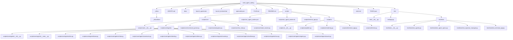

# multi_agent_coding — Architecture

> Baseline-zero system map (plain 7-agent dispatch, no specialized machinery).
> Last synced: 2026-08-11 UTC

## System Map

```mermaid
flowchart TD
    ROOT["multi_agent_coding"]
    ROOT --> N_inbox["_inbox"]
    N_inbox --> N_inbox_done["_inbox/done"]
    ROOT --> N_AGENTS_md["AGENTS.md"]
    ROOT --> N_docs["docs"]
    ROOT --> N_launch_agents_bat["launch_agents.bat"]
    ROOT --> N_launch_terminal_bat["launch_terminal.bat"]
    ROOT --> N_opencode_json["opencode.json"]
    ROOT --> N_PLAN_md["PLAN.md"]
    ROOT --> N_README_md["README.md"]
    ROOT --> N_scripts["scripts"]
    N_scripts --> N_scripts_core["scripts/core"]
    N_scripts_core --> N_scripts_core___init___py["scripts/core/__init__.py"]
    N_scripts_core --> N_scripts_core_agents["scripts/core/agents"]
    N_scripts_core_agents --> N_scripts_core_agents___init___py["scripts/core/agents/__init__.py"]
    N_scripts_core_agents --> N_scripts_core_agents___main___py["scripts/core/agents/__main__.py"]
    N_scripts_core_agents --> N_scripts_core_agents_alex_py["scripts/core/agents/alex.py"]
    N_scripts_core_agents --> N_scripts_core_agents_base_py["scripts/core/agents/base.py"]
    N_scripts_core_agents --> N_scripts_core_agents_chloe_py["scripts/core/agents/chloe.py"]
    N_scripts_core_agents --> N_scripts_core_agents_constants_py["scripts/core/agents/constants.py"]
    N_scripts_core_agents --> N_scripts_core_agents_david_py["scripts/core/agents/david.py"]
    N_scripts_core_agents --> N_scripts_core_agents_elena_py["scripts/core/agents/elena.py"]
    N_scripts_core_agents --> N_scripts_core_agents_master_py["scripts/core/agents/master.py"]
    N_scripts_core_agents --> N_scripts_core_agents_matthew_py["scripts/core/agents/matthew.py"]
    N_scripts_core_agents --> N_scripts_core_agents_max_py["scripts/core/agents/max.py"]
    N_scripts_core_agents --> N_scripts_core_agents_registry_py["scripts/core/agents/registry.py"]
    N_scripts_core_agents --> N_scripts_core_agents_sarah_py["scripts/core/agents/sarah.py"]
    N_scripts_core --> N_scripts_core_command_parser_py["scripts/core/command_parser.py"]
    N_scripts_core --> N_scripts_core_progress_py["scripts/core/progress.py"]
    N_scripts_core --> N_scripts_core_run_hub_py["scripts/core/run_hub.py"]
    N_scripts_core --> N_scripts_core_state_tracker_py["scripts/core/state_tracker.py"]
    N_scripts --> N_scripts_run_agent_worker_ps1["scripts/run_agent_worker.ps1"]
    N_scripts --> N_scripts_run_agent_worker_sh["scripts/run_agent_worker.sh"]
    N_scripts --> N_scripts_terminal_app_py["scripts/terminal_app.py"]
    N_scripts --> N_scripts_ui["scripts/ui"]
    N_scripts_ui --> N_scripts_ui___init___py["scripts/ui/__init__.py"]
    N_scripts_ui --> N_scripts_ui_palette_py["scripts/ui/palette.py"]
    N_scripts_ui --> N_scripts_ui_rendering_py["scripts/ui/rendering.py"]
    N_scripts_ui --> N_scripts_ui_terminal_app_py["scripts/ui/terminal_app.py"]
    N_scripts_ui --> N_scripts_ui_theme_py["scripts/ui/theme.py"]
    ROOT --> N_state_md["state.md"]
    ROOT --> N_TASKS_json["TASKS.json"]
    ROOT --> N_test["test"]
    N_test --> N_test___init___py["test/__init__.py"]
    N_test --> N_test_app_py["test/app.py"]
    N_test --> N_test_tests["test/tests"]
    N_test_tests --> N_test_tests___init___py["test/tests/__init__.py"]
    N_test_tests --> N_test_tests_test_agents_py["test/tests/test_agents.py"]
    N_test_tests --> N_test_tests_test_agent_specs_py["test/tests/test_agent_specs.py"]
    N_test_tests --> N_test_tests_test_expense_manager_py["test/tests/test_expense_manager.py"]
    N_test_tests --> N_test_tests_test_terminal_app_py["test/tests/test_terminal_app.py"]
```
