# multi_agent_coding — Architecture

> Maintained by the Architectural Obsidian Archivist (M7).
> Last synced: 2026-08-11 06:20 UTC
<!-- fingerprint: eb2c1ee4868e -->

## Decisions & Milestones

_No architectural decisions captured yet._

## System Map

```mermaid
flowchart TD
    ROOT["multi_agent_coding"]
    ROOT --> N_inbox["_inbox"]
    N_inbox --> N_inbox_done["_inbox/done"]
    ROOT --> N_AGENTS_md["AGENTS.md"]
    ROOT --> N_docs["docs"]
    ROOT --> N_launch_agents_bat["launch_agents.bat"]
    ROOT --> N_launch_terminal_bat["launch_terminal.bat"]
    ROOT --> N_launch_web_bat["launch_web.bat"]
    ROOT --> N_opencode_json["opencode.json"]
    ROOT --> N_PLAN_md["PLAN.md"]
    ROOT --> N_README_md["README.md"]
    ROOT --> N_scripts["scripts"]
    N_scripts --> N_scripts_agent_logger_py["scripts/agent_logger.py"]
    N_scripts --> N_scripts_core["scripts/core"]
    N_scripts_core --> N_scripts_core___init___py["scripts/core/__init__.py"]
    N_scripts_core --> N_scripts_core_agent_definitions_py["scripts/core/agent_definitions.py"]
    N_scripts_core --> N_scripts_core_archivist_py["scripts/core/archivist.py"]
    N_scripts_core --> N_scripts_core_command_parser_py["scripts/core/command_parser.py"]
    N_scripts_core --> N_scripts_core_config_py["scripts/core/config.py"]
    N_scripts_core --> N_scripts_core_intent_classifier_py["scripts/core/intent_classifier.py"]
    N_scripts_core --> N_scripts_core_progress_py["scripts/core/progress.py"]
    N_scripts_core --> N_scripts_core_run_hub_py["scripts/core/run_hub.py"]
    N_scripts_core --> N_scripts_core_self_evolve_bridge_py["scripts/core/self_evolve_bridge.py"]
    N_scripts_core --> N_scripts_core_state_tracker_py["scripts/core/state_tracker.py"]
    N_scripts --> N_scripts_intent_router_py["scripts/intent_router.py"]
    N_scripts --> N_scripts_obsidian_auditor_py["scripts/obsidian_auditor.py"]
    N_scripts --> N_scripts_prompt_logger_py["scripts/prompt_logger.py"]
    N_scripts --> N_scripts_run_agent_worker_ps1["scripts/run_agent_worker.ps1"]
    N_scripts --> N_scripts_run_agent_worker_sh["scripts/run_agent_worker.sh"]
    N_scripts --> N_scripts_self_evolve_py["scripts/self_evolve.py"]
    N_scripts --> N_scripts_swarm_py["scripts/swarm.py"]
    N_scripts --> N_scripts_terminal_app_py["scripts/terminal_app.py"]
    N_scripts --> N_scripts_ui["scripts/ui"]
    N_scripts_ui --> N_scripts_ui___init___py["scripts/ui/__init__.py"]
    N_scripts_ui --> N_scripts_ui_palette_py["scripts/ui/palette.py"]
    N_scripts_ui --> N_scripts_ui_rendering_py["scripts/ui/rendering.py"]
    N_scripts_ui --> N_scripts_ui_settings_modal_py["scripts/ui/settings_modal.py"]
    N_scripts_ui --> N_scripts_ui_terminal_app_py["scripts/ui/terminal_app.py"]
    N_scripts_ui --> N_scripts_ui_theme_py["scripts/ui/theme.py"]
    N_scripts --> N_scripts_web_app_py["scripts/web_app.py"]
    ROOT --> N_state_md["state.md"]
    ROOT --> N_TASKS_json["TASKS.json"]
    ROOT --> N_test["test"]
    N_test --> N_test___init___py["test/__init__.py"]
    N_test --> N_test_app_py["test/app.py"]
    N_test --> N_test_expense_manager_py["test/expense_manager.py"]
    N_test --> N_test_expense_tracker_py["test/expense_tracker.py"]
    N_test --> N_test_PLAN_md["test/PLAN.md"]
    N_test --> N_test_README_md["test/README.md"]
    N_test --> N_test_TASKS_json["test/TASKS.json"]
    N_test --> N_test_test_expense_tracker_py["test/test_expense_tracker.py"]
    N_test --> N_test_tests["test/tests"]
    N_test_tests --> N_test_tests___init___py["test/tests/__init__.py"]
    N_test_tests --> N_test_tests_test_archivist_py["test/tests/test_archivist.py"]
    N_test_tests --> N_test_tests_test_expense_manager_py["test/tests/test_expense_manager.py"]
    N_test_tests --> N_test_tests_test_intent_router_py["test/tests/test_intent_router.py"]
    N_test_tests --> N_test_tests_test_self_evolve_py["test/tests/test_self_evolve.py"]
    N_test_tests --> N_test_tests_test_swarm_py["test/tests/test_swarm.py"]
    N_test_tests --> N_test_tests_test_terminal_app_py["test/tests/test_terminal_app.py"]
    N_test_tests --> N_test_tests_test_web_app_py["test/tests/test_web_app.py"]
```

