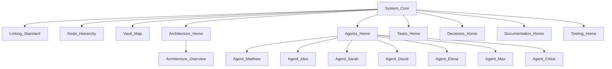

# Vault_Map

> Full map of the knowledge graph. Keep in sync with reality whenever nodes
> are added or removed.

**Type:** system · **Status:** active · **Owner:** all agents

---

- ↑ Parent: [[System_Core]]
- ↔ Related: [[Node_Schema_Reference]]

## Graph

## Node Inventory

| Node | Section | Type | Parent |
|---|---|---|---|
| `System_Core` | 00-System | system | — (root) |
| `Linking_Standard` | 00-System | system | `System_Core` |
| `Node_Hierarchy` | 00-System | system | `System_Core` |
| `Vault_Map` | 00-System | system | `System_Core` |
| `Architecture_Home` | 01-Architecture | architecture | `System_Core` |
| `Architecture_Overview` | 01-Architecture | architecture | `Architecture_Home` |
| `Agents_Home` | 02-Agents | agent | `System_Core` |
| `Agent_Matthew` | 02-Agents | agent | `Agents_Home` |
| `Agent_Alex` | 02-Agents | agent | `Agents_Home` |
| `Agent_Sarah` | 02-Agents | agent | `Agents_Home` |
| `Agent_David` | 02-Agents | agent | `Agents_Home` |
| `Agent_Elena` | 02-Agents | agent | `Agents_Home` |
| `Agent_Max` | 02-Agents | agent | `Agents_Home` |
| `Agent_Chloe` | 02-Agents | agent | `Agents_Home` |
| `Tasks_Home` | 03-Tasks | task | `System_Core` |
| `Decisions_Home` | 04-Decisions | decision | `System_Core` |
| `Documentation_Home` | 05-Documentation | documentation | `System_Core` |
| `Testing_Home` | 06-Testing | test | `System_Core` |

## Validation Checklist

- [ ] Every `[[Link]]` resolves to an existing file.
- [ ] Every node (except `System_Core`) has an `↑ Parent:` link.
- [ ] Every hub lists its children in `↓ Children:`.
- [ ] No duplicate node names.
- [ ] No orphan nodes (no node with zero inbound links).
