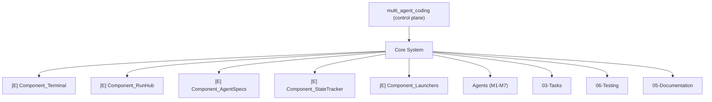

# System_Architecture

> The high-level architecture map of the MultiAgentCoding control plane.
> Components below reflect **real files verified in the project** — nothing
> invented.

**Type:** architecture · **Status:** active · **Owner:** architect

---

## Legend

- `[E]` **Existing** — component exists in the codebase today
- `[P]` **Planned** — designed but not yet implemented
- `[F]` **Future** — reserved, not yet designed in detail

## System Map

## Component Index

| Status | Component | Source (verified) | Responsibility |
|---|---|---|---|
| [E] | [[Component_Terminal]] | `scripts/terminal_app.py` → `scripts/ui/` | Full-screen prompt_toolkit UI (ZOVA retro terminal, tabs M1–M7 + MASTER) |
| [E] | [[Component_RunHub]] | `scripts/core/run_hub.py` | Thread-safe dispatch engine: one thread per agent → `opencode run` |
| [E] | [[Component_AgentSpecs]] | `scripts/core/agents/` | Agent definitions (`AgentSpec`) + registry + `__main__.py` CLI |
| [E] | [[Component_StateTracker]] | `scripts/core/state_tracker.py` | Atomic read/write of `state.md` session checkpoint |
| [E] | [[Component_Launchers]] | `launch_agents.bat`, `launch_terminal.bat`, `scripts/run_agent_worker.ps1/.sh` | 7-window inbox launcher, terminal launcher, inbox-polling workers |

## Agents

The roster is documented under [[Agents_Home]] with one node per agent
([[Agent_Matthew]] … [[Agent_Chloe]]). Agents dispatch through
[[Component_RunHub]] using their configured models from [[Component_AgentSpecs]].

## Planned / Future

- `[P]` Vault bridge (`scripts/vault_bridge.py`) — planned programmatic
  read/write of vault notes (see project plan Phase 02).
- `[P]` `/vault` terminal command — planned ZOVA terminal command to open the
  vault / notes via the Obsidian URI scheme.
- `[F]` Role-based agents (Architect, Coding, Testing, Orchestrator) — future;
  the vault sections (01–06) are pre-structured for them.

## Links

- ↑ Parent: [[Architecture_Home]]
- ↔ Related: [[Architecture_Overview]], [[Agents_Home]], [[Tasks_Home]], [[Testing_Home]], [[Documentation_Home]]
